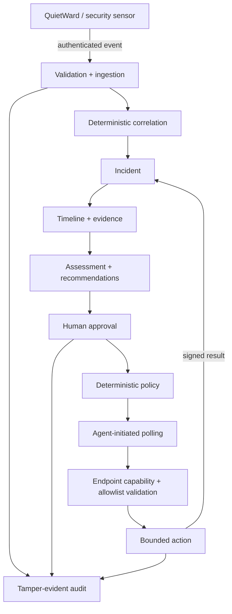

# QuietWard Response

**Turn endpoint detections into controlled, auditable action — without shipping a remote shell.**

[](LICENSE)


QuietWard Response is an event-driven incident investigation and controlled-response platform for local and trusted-network security environments.

It takes authenticated security observations, turns them into explainable incidents, reconstructs timelines, recommends next steps, requires explicit analyst approval, applies deterministic policy, and coordinates tightly typed endpoint actions with signed results and tamper-evident auditing.

> **The design goal:** move from **detect** to **act** without turning the control plane into unrestricted remote administration.

## The problem it explores

A defensive system eventually needs to answer more than “something looks suspicious.” It needs to answer:

1. What happened?
2. Which events belong to the same incident?
3. What should be investigated next?
4. Is an endpoint action justified?
5. Who approved it?
6. Did the endpoint execute exactly what was authorized?
7. Can the result be verified afterward?

QuietWard Response is built around that lifecycle.

```text
observation
   ↓
authenticated ingestion
   ↓
deterministic correlation
   ↓
incident + timeline
   ↓
recommendation
   ↓
analyst approval
   ↓
deterministic policy
   ↓
typed endpoint action
   ↓
signed result
   ↓
tamper-evident audit
```

## What makes it different

| Capability | Approach |
| --- | --- |
| **No generic command surface** | No arbitrary shell, PowerShell, cmd, bash, PID/path targeting, or LLM-generated command execution. |
| **Human-controlled actions** | Endpoint actions require explicit analyst approval and deterministic server-side policy. |
| **Endpoint-side validation** | The endpoint independently verifies the typed action and its declared capabilities before execution. |
| **Authenticated telemetry** | HMAC-SHA256 authentication, timestamp windows, persisted nonces, and replay resistance. |
| **Explainable incidents** | Deterministic correlation, evidence, timelines, and recommendation reasoning are retained. |
| **Idempotent execution** | Retry/recovery paths reconcile terminal state without silently executing the same action twice. |
| **Tamper-evident audit** | Security-relevant state changes are written to a hash-chained audit ledger with verification support. |

## QuietWard + Response

The current `1.1.0a1` preview adds a paired workflow with **[QuietWard](https://github.com/LUKEcheadle-ship-it/quietward)**, while keeping detection authority and response authority separated.

```mermaid
flowchart LR
    Q[QuietWard] -->|sanitized verified handoff| R[Response ingestion]
    R --> I[Incident + timeline]
    I --> A[Analyst approval]
    A --> P[Deterministic policy]
    P --> E[Response endpoint agent]
    E -->|read-only typed diagnostic| S[Signed result]
    S --> U[Tamper-evident audit]
```



QuietWard remains observation-only and holds no Response network credential. Response owns the authenticated ingestion, approval, policy, action lifecycle, endpoint capability validation, and audit trail.

## Current controlled action surface

The preview intentionally keeps the executable surface small.

### Read-only diagnostics

- `collect_host_diagnostic`
- `collect_process_diagnostic`
- `collect_network_diagnostic` on supported Linux endpoints

These are parameterless, capability-declared, approval-gated actions designed for bounded investigation rather than arbitrary host access.

### Existing demonstration mutation

`restart_quietward_demo_service`

Despite the name, this does **not** restart an operating-system service. It changes only a dedicated JSON demo fixture used to prove the controlled mutation lifecycle.

There is still no general service control, process termination, quarantine, firewall modification, host isolation, or arbitrary command execution.

## Qualification evidence

The exact QuietWard `0.6.0a1` + Response `1.1.0a1` candidate pair was promoted to `main` only after the complete paired gate passed on both Linux and Windows runners.

Final gate evidence included:

- **97 Response backend tests on Linux**
- **96 Response backend tests + 1 platform-appropriate skip on Windows**
- fresh migrations, upgrade migrations, and Alembic drift verification
- frontend TypeScript checks and production Next.js build
- **npm audit: 0 vulnerabilities**
- public quick-start startup/shutdown smoke
- **441 QuietWard tests** with platform-appropriate skips
- **12 focused QuietWard handoff/privacy/integrity tests**
- public-release audits for both repositories
- live cross-repository QuietWard → Response acceptance
- signed action/result lifecycle verification
- audit-chain verification
- confirmation that the diagnostic changed **no system state**
- confirmation that raw QuietWard finding subjects **did not cross the boundary**

The exact tested SHAs are documented in the merged joint-update PRs and qualification evidence.

## Architecture



The endpoint agent polls outward for authorized work rather than exposing an inbound general-purpose command listener.

## Quick start

Requirements:

- Python 3.12+
- Node.js 22+
- npm
- Git

```bash
git clone https://github.com/LUKEcheadle-ship-it/quietward-response.git
cd quietward-response
python scripts/bootstrap_local.py
```

Windows:

```text
py -3.12 scripts\bootstrap_local.py
```

Default local surfaces:

- Analyst console: `http://localhost:3001`
- API: `http://localhost:8002`
- API docs: `http://localhost:8002/docs`
- Health: `http://localhost:8002/health`
- Audit verification: `http://localhost:8002/api/v1/audit/verify`

Populate safe synthetic investigation data after startup:

```bash
python scripts/seed_demo.py --api-url http://localhost:8002
```

### Docker Compose

```bash
cp .env.example .env
# replace QWR_ENROLLMENT_TOKEN with a random 24+ character value
docker compose up --build
```

Docker Compose uses PostgreSQL and maps the API/frontend to loopback by default.

## Verify the joint system

Run the complete v1.1 paired gate with a sibling QuietWard checkout:

```bash
python scripts/verify_v11_diagnostics.py --quietward-repo ../quietward
```

That gate covers Response tests, public-release audit, migrations, frontend install/typecheck/build/audit, quick-start smoke, the complete QuietWard suite, the focused v0.6 handoff gate, and live cross-repository acceptance.

## Security boundary

QuietWard Response is a local/trusted-network security project and architecture demonstration. It is **not** being presented as an Internet-facing production EDR/XDR/SOAR replacement.

The current preview deliberately has:

- no generic shell / PowerShell / cmd / bash execution
- no arbitrary process termination
- no arbitrary service control
- no file quarantine or deletion
- no firewall modification
- no host/network isolation
- no LLM-generated command execution
- no autonomous remediation
- no enterprise OIDC/RBAC claim
- no multi-tenant/horizontal-scaling claim

Analyst identity remains local-development grade. HMAC transport should use TLS outside loopback/trusted local development. The audit chain provides tamper evidence, not immutable storage.

See [`SECURITY.md`](SECURITY.md) and [`docs/threat-model.md`](docs/threat-model.md).

## Explore the project

- [`docs/JOINT_QUIETWARD_RESPONSE_UPDATE.md`](docs/JOINT_QUIETWARD_RESPONSE_UPDATE.md) — paired-system design
- [`docs/V11_DIAGNOSTIC_UPGRADE.md`](docs/V11_DIAGNOSTIC_UPGRADE.md) — v1.1 diagnostic upgrade
- [`docs/architecture.md`](docs/architecture.md) — architecture
- [`docs/threat-model.md`](docs/threat-model.md) — trust model
- [`protocol/README.md`](protocol/README.md) — event/action protocol
- [`CHANGELOG.md`](CHANGELOG.md) — release history
- [`CONTRIBUTING.md`](CONTRIBUTING.md) — contribution requirements

## Portfolio snapshot

Built and qualified a FastAPI/Next.js security-response platform with authenticated telemetry, deterministic incident correlation, human-approved policy-gated endpoint diagnostics, capability declarations, replay protection, idempotent execution, signed results, live cross-repository integration, migrations, and tamper-evident auditing.

## License

Apache License 2.0. See [`LICENSE`](LICENSE).
