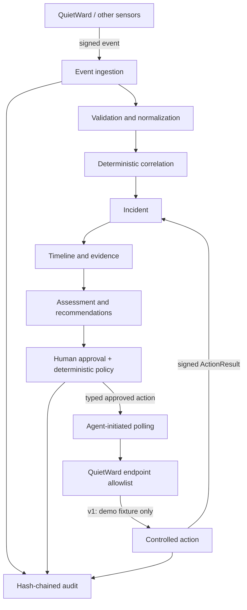

# QuietWard Response

QuietWard Response is an event-driven incident investigation and controlled-response platform. It validates sensor events, tracks hosts, deterministically correlates related observations into incidents, reconstructs timelines, recommends investigation steps, and records a tamper-evident audit trail.

The v1 line adds an optional two-way QuietWard integration: authenticated endpoint telemetry, replay-resistant agent polling, explicit human approval, deterministic policy evaluation, and one deliberately isolated demo remediation. There is still **no arbitrary command execution** and no general host-remediation surface.

> **Release status:** the current development branch is `1.0.0rc1` until the documented automated and UI acceptance gates are executed successfully. The source is intentionally not labeled `1.0.0` before those gates pass.

## Relationship with QuietWard

| Project | Responsibility |
|---|---|
| **QuietWard** | Detection, endpoint telemetry, endpoint-side validation, optional polling of approved typed actions |
| **QuietWard Response** | Correlation, investigation, recommendations, approval/policy, response coordination, and audit |

Neither project requires the other to exist. QuietWard remains fully functional when Response integration is disabled or unavailable.

## Architecture



See [architecture](docs/architecture.md), [event/action protocol](protocol/README.md), [threat model](docs/threat-model.md), [v1 acceptance](docs/V1_ACCEPTANCE.md), and [roadmap](docs/roadmap.md).

## Quick start

Requirements: Python 3.12+, Node.js 22+, npm, Bash, and curl.

```bash
git clone https://github.com/LUKEcheadle-ship-it/quietward-response.git
cd quietward-response
./scripts/bootstrap_local.sh
```

`bootstrap_local.sh` creates a private local `.env` if needed, replaces the known development enrollment token with a random local token, installs the local Python/Node dependencies through the normal launchers, applies database migrations, starts the API and frontend, and refuses to report ready unless both are reachable.

A normal v1 startup begins with a clean incident database; it does **not** inject synthetic incidents.

- Frontend: <http://localhost:3001>
- API: <http://localhost:8002>
- API docs: <http://localhost:8002/docs>
- Health: <http://localhost:8002/health>
- Audit verification: <http://localhost:8002/api/v1/audit/verify>

Press `Ctrl+C` to stop both services.

### Manual local start

If you prefer to manage `.env` yourself:

```bash
cp .env.example .env
# replace QWR_ENROLLMENT_TOKEN with a random 24+ character value
./scripts/run_all.sh
```

To populate the original three safe synthetic investigation scenarios after startup:

```bash
python scripts/seed_demo.py --api-url http://localhost:8002
```

You can also set `QWR_SEED_DEMO=true` before `run_all.sh` when you specifically want those demo incidents created at startup.

### Run components separately

```bash
./scripts/run_backend.sh
./scripts/run_frontend.sh
```

The frontend launcher reads the repository API configuration so a local `QWR_API_PORT` / `NEXT_PUBLIC_API_URL` override does not leave the browser pointing at the default API port.

### Docker Compose

Docker Compose uses PostgreSQL and maps the API and frontend to loopback only. Set a non-empty enrollment token before startup:

```bash
cp .env.example .env
# replace QWR_ENROLLMENT_TOKEN in .env
docker compose up --build
```

## Enroll a QuietWard endpoint

Start Response first, then enroll the endpoint once:

```bash
python scripts/enroll_quietward.py --host-id YOUR_QUIETWARD_HOST_ID
```

The enrollment helper reads the Response URL and enrollment token from the repository `.env` by default. You can still override either with `--api-url` or `--token`.

The command prints these one-time endpoint values:

```text
QUIETWARD_RESPONSE_ENABLED=true
QUIETWARD_RESPONSE_URL=http://127.0.0.1:8002
QUIETWARD_RESPONSE_AGENT_ID=...
QUIETWARD_RESPONSE_KEY_ID=...
QUIETWARD_RESPONSE_SECRET=...
```

Store the secret securely on the endpoint. Response stores derived HMAC key material rather than the original enrollment secret, but that derived material is still secret-equivalent.

Authenticated agent requests bind the HTTP method, target path/query, Unix timestamp, random nonce, and SHA-256 body digest into an HMAC-SHA256 signature. The server enforces a bounded replay window and persists used agent nonces.

## v1 controlled response demo

The only executable v1 action is:

`restart_quietward_demo_service`

Despite the name, this does **not** restart an operating-system service. It modifies only a dedicated QuietWard-owned JSON demo fixture named `quietward-response-demo.json`. The endpoint rejects arbitrary action types, arbitrary service names, executable paths, shell fragments, and non-empty parameters.

On the QuietWard integration build, initialize the fixture as unhealthy and send its authenticated event:

```bash
python scripts/quietward_response_demo.py init-unhealthy --host-id YOUR_QUIETWARD_HOST_ID
python scripts/quietward_response_demo.py sync --host-id YOUR_QUIETWARD_HOST_ID
```

Response creates an incident and exposes the allowlisted recommendation. In the incident console:

1. Choose the intended enabled QuietWard agent if more than one credential exists for an affected host.
2. Prepare the controlled action.
3. Approve it.
4. Run another QuietWard `sync` or normal service cycle.
5. QuietWard polls for the approved action, validates it locally, changes only the dedicated demo fixture, and returns a signed result.
6. Response shows the terminal result and records the lifecycle in the audit chain.

The endpoint persists execution intent and a terminal-result ledger, and the dedicated fixture records the applied action ID. This allows an interrupted `executing` action to be reconciled without changing the fixture twice. Event retries treat only an identical already-accepted event ID as successful delivery; reusing an event ID with different content is rejected as an integrity conflict.

## API

Core endpoints:

- `POST /api/v1/events`
- `GET /api/v1/events`
- `GET /api/v1/hosts`
- `GET /api/v1/hosts/{host_id}`
- `GET /api/v1/incidents`
- `GET /api/v1/incidents/{incident_id}`
- `PATCH /api/v1/incidents/{incident_id}`
- `GET /api/v1/overview`

Controlled-response endpoints:

- `POST /api/v1/agents/enroll`
- `GET /api/v1/agents`
- `GET /api/v1/agents/{agent_id}`
- `PATCH /api/v1/agents/{agent_id}`
- `GET /api/v1/actions/registry`
- `POST /api/v1/incidents/{incident_id}/actions`
- `GET /api/v1/incidents/{incident_id}/actions`
- `POST /api/v1/actions/{action_id}/approve`
- `POST /api/v1/actions/{action_id}/reject`
- `GET /api/v1/agents/{agent_id}/actions/pending` — agent-authenticated
- `POST /api/v1/actions/{action_id}/result` — agent-authenticated
- `GET /api/v1/audit/verify`

Events claiming `source=quietward` require authenticated agent delivery when `QWR_REQUIRE_AGENT_AUTH_FOR_QUIETWARD_EVENTS=true`. Synthetic/development sources remain available for the local demo; outside development, unauthenticated generic sensor sources fail closed until they have an authenticated adapter.

## v1 verification

The complete release-candidate gate is:

```bash
python scripts/finalize_v1.py --quietward-repo ../quietward
```

The underlying gates can also be run separately:

```bash
python scripts/verify_v1.py --quietward-repo ../quietward
python scripts/verify_v1_live.py --quietward-repo ../quietward
```

See [docs/V1_ACCEPTANCE.md](docs/V1_ACCEPTANCE.md) for exactly what each gate proves and the final UI smoke check.

## Safety status

QuietWard Response v1 is intentionally a controlled local-development response system, not an unrestricted remote administration service.

Current guarantees are deliberately narrow:

- no shell/PowerShell/cmd/bash action
- no arbitrary process termination
- no arbitrary service control
- no file deletion/quarantine
- no firewall modification
- no host isolation
- no LLM-generated command execution
- agent-initiated polling instead of an inbound endpoint command listener
- one demo-fixture action requiring human approval and deterministic policy validation

v1 is intentionally qualified as a **single-process/single-worker** API. Both the native launcher and backend container enforce one Uvicorn worker because request serialization protects the linear audit-chain append model. Do not horizontally scale this version against one database; multi-worker support requires a database-backed atomic audit append/head mechanism and requalification.

Analyst identity is still local-development grade (`X-Actor-ID`) rather than OIDC/RBAC. HMAC should be carried over TLS outside loopback/local trusted development. The audit chain provides tamper evidence, not immutability.

Licensed under Apache-2.0.
