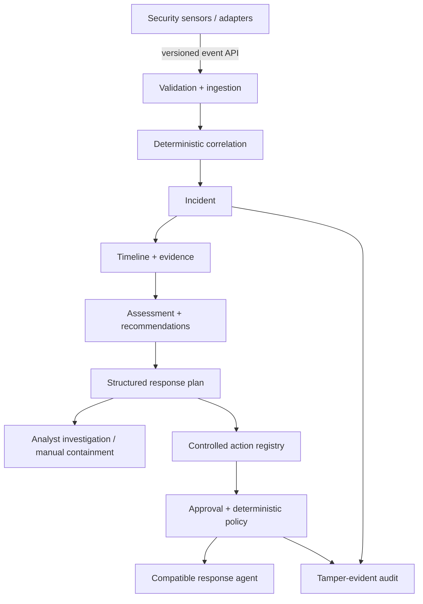

# QuietWard Response

QuietWard Response is a standalone incident-investigation and controlled-response platform. It accepts validated security telemetry, correlates related observations into incidents, reconstructs timelines, generates structured response plans, manages analyst decisions, and records a tamper-evident audit trail.

It is a **separate product and repository from QuietWard**. Response does not require changes to QuietWard and does not modify the QuietWard repository. Any detector or sensor can integrate through a separately maintained adapter or the versioned event API.

> **Alpha candidate:** `v1.1.0-alpha.1` (`1.1.0a1`) on `feature/response-diagnostic-expansion`.
>
> The alpha adds broad response planning for malware/file, process/privilege, identity/authentication, persistence, network, container, vulnerability/configuration, sensor/evidence-integrity, and operational incidents. Planned/manual steps are clearly distinguished from executable actions.
>
> The executable endpoint surface remains deliberately narrow: `restart_quietward_demo_service` is the only registered action and exists only as the previously qualified demo-fixture lifecycle. There is no generic remote command surface.

## What the alpha does

For each incident, Response exposes a deterministic structured plan at:

`GET /api/v1/incidents/{incident_id}/response-plan`

A plan contains:

- detected response families;
- response priority;
- evidence-preservation and scoping objectives;
- investigation steps;
- containment steps;
- recovery steps;
- escalation conditions;
- explicit step state: `available`, `manual`, `planned`, or `blocked`;
- the exact list of executable actions, which is normally empty;
- product limitations so guidance cannot be mistaken for hidden automation.

### Covered response families

| Family | Alpha response coverage |
|---|---|
| Malware / suspicious files | artifact validation, process/network correlation, quarantine plan, trusted-source recovery |
| Process / privilege | process-tree review, privilege scoping, bounded process-containment plan |
| Identity / authentication | session/account investigation, session-revocation plan, temporary lock plan, credential recovery |
| Persistence | persistence-object review, disable plan with preserved original state, recurrence verification |
| Network | listener/destination review, temporary block plan, future host-isolation boundary, connectivity recovery |
| Containers | image/configuration/privilege review, stop-container plan, trusted recreation |
| Vulnerabilities / configuration | exposure validation, compensating controls, patch/hardening recovery |
| Sensor / evidence integrity | trust review, audit/collection integrity checks, manual credential revocation guidance |
| Operational issues | separate operational failure from adversarial activity and preserve evidence before recovery |

These plans make the system useful across many incident types **without pretending unsupported host automation exists**.

## Architecture



The control plane never turns plan text into shell commands. An action must exist in the explicit action registry before the action API can create it.

## Quick start

Requirements:

- Python 3.12+
- Node.js 22+
- npm
- Git

```text
git clone https://github.com/LUKEcheadle-ship-it/quietward-response.git
cd quietward-response
python scripts/bootstrap_local.py
```

On Windows, `py -3.12 scripts\bootstrap_local.py` is also supported when Python is installed through the Python launcher.

The bootstrap path creates local configuration, generates a private development enrollment token when needed, applies migrations, installs dependencies, and starts both product surfaces. It refuses to report ready unless the API and frontend are reachable and cleans up the process groups on shutdown.

- Frontend: <http://localhost:3001>
- API: <http://localhost:8002>
- API docs: <http://localhost:8002/docs>
- Health: <http://localhost:8002/health>
- Audit verification: <http://localhost:8002/api/v1/audit/verify>

Press `Ctrl+C` to stop both services.

### Populate local investigation data

The existing safe demo seed remains available:

```text
python scripts/seed_demo.py --api-url http://localhost:8002
```

You can also submit versioned synthetic events directly to `POST /api/v1/events` in the loopback development environment. Unauthenticated generic sensor sources are intentionally rejected outside development until they have an authenticated adapter/trust contract.

## Incident workflow

1. Ingest validated telemetry.
2. Correlate events into an incident.
3. Review the timeline, evidence, probable cause, and correlation reasons.
4. Review the structured response plan.
5. Perform the available investigation steps.
6. Choose manual/planned containment appropriate to the environment.
7. Use the controlled-action API only when an action is explicitly registered and available for that incident.
8. Move the incident through `new`, `investigating`, `contained`, `resolved`, or `dismissed`.
9. Verify the audit chain.

The incident UI clearly labels planned/manual guidance as **not executable**.

## Controlled-action boundary

The alpha action registry contains exactly one executable action:

`restart_quietward_demo_service`

This is a compatibility/demo capability. It is not a general service manager and accepts no service name, path, PID, IP address, command, script, or arbitrary parameters.

All other response capabilities shown in a plan are currently `manual`, `planned`, or `blocked` until a dedicated Response agent implements a narrow typed executor with:

- exact target identity;
- endpoint-side allowlisting;
- preconditions;
- expiry;
- analyst approval;
- deterministic policy;
- idempotency;
- timeout/failure semantics;
- evidence preservation;
- rollback metadata where applicable;
- adversarial validation.

## Core API

Investigation:

- `POST /api/v1/events`
- `GET /api/v1/events`
- `GET /api/v1/hosts`
- `GET /api/v1/hosts/{host_id}`
- `GET /api/v1/incidents`
- `GET /api/v1/incidents/{incident_id}`
- `GET /api/v1/incidents/{incident_id}/response-plan`
- `PATCH /api/v1/incidents/{incident_id}`
- `GET /api/v1/overview`

Controlled response:

- `POST /api/v1/agents/enroll`
- `GET /api/v1/agents`
- `GET /api/v1/agents/{agent_id}`
- `PATCH /api/v1/agents/{agent_id}`
- `GET /api/v1/actions/registry`
- `POST /api/v1/incidents/{incident_id}/actions`
- `GET /api/v1/incidents/{incident_id}/actions`
- `POST /api/v1/actions/{action_id}/approve`
- `POST /api/v1/actions/{action_id}/reject`
- `GET /api/v1/agents/{agent_id}/actions/pending`
- `POST /api/v1/actions/{action_id}/result`
- `GET /api/v1/audit/verify`

Authenticated agent requests bind method, path/query, timestamp, nonce, and body digest with HMAC-SHA256. Replay nonces are persisted and consumed before later business validation.

## Alpha verification

Run the static/local gate:

```text
python scripts/verify_v11_alpha.py
```

Run the standalone live HTTP acceptance:

```text
python scripts/verify_v11_alpha_live.py
```

On an exact clean candidate checkout, the final automated wrapper is:

```text
python scripts/finalize_v11_alpha.py
```

No detector repository checkout is required or modified by these gates.

See:

- `docs/V11_ALPHA_ACCEPTANCE.md`
- `docs/V11_ALPHA_THREAT_MODEL.md`
- `docs/V1_ACCEPTANCE.md` for the historical v1 qualification record
- `docs/threat-model.md`
- `docs/roadmap.md`

## Safety boundary

The alpha is a controlled local/trusted-network response system, not unrestricted remote administration.

Not available:

- arbitrary shell / PowerShell / cmd / bash
- generic command execution
- arbitrary process termination
- arbitrary service control
- file deletion or quarantine automation
- firewall modification automation
- host isolation automation
- arbitrary account mutation
- package/configuration mutation
- autonomous remediation
- LLM-generated executable commands

Additional controls:

- strict Pydantic request envelopes;
- action allowlist separate from response-plan guidance;
- explicit human approval for registered actions;
- deterministic policy revalidation before dispatch;
- action expiry and lifecycle checks;
- bounded ActionResult/evidence serialized sizes;
- replay-resistant authenticated agent requests;
- single-process/single-worker qualification boundary;
- hash-chained audit verification at startup and on demand.

## Known alpha limitations

- analyst identity is development-grade `X-Actor-ID`, not OIDC/RBAC;
- HMAC transport assumes TLS outside loopback/trusted development;
- the audit chain is tamper-evident, not immutable;
- the API is qualified only as a single process/single worker;
- most real containment steps are guidance until the separate Response agent layer is implemented and qualified;
- the product is not a SIEM, EDR replacement, or autonomous remediation system.

Licensed under Apache-2.0.
