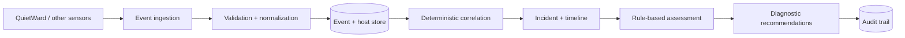

# QuietWard Response

QuietWard Response is an event-driven incident investigation and response coordination platform. It receives versioned security and operational telemetry, builds explainable incidents, reconstructs timelines, recommends safe investigation steps, and records every decision in an audit trail.

## Relationship with QuietWard

- **QuietWard** provides detection and endpoint telemetry.
- **QuietWard Response** provides correlation, investigation, and response coordination.

They are separate projects. Neither requires the other: QuietWard Response accepts a versioned, vendor-neutral event envelope and can support additional sensors over time.

## Architecture



Phase 1 deliberately excludes endpoint control and destructive remediation. Remediation items are planning guidance and are visibly disabled.

## Quick start

Prerequisites: Python 3.12+, Node.js 20+, and Bash (Git Bash, WSL, macOS, or Linux).

```bash
git clone https://github.com/LUKEcheadle-ship-it/quietward-response.git
cd quietward-response
git checkout feature/phase1-foundation
cp .env.example .env
./scripts/run_all.sh
```

Then open:

- Frontend: http://localhost:3000
- API: http://localhost:8001
- API docs: http://localhost:8001/docs
- Health: http://localhost:8001/api/v1/health

Seed all three safe demo scenarios while the API is running:

```bash
python scripts/seed_demo.py
```

## Development

```bash
python -m venv .venv
source .venv/bin/activate  # Windows PowerShell: .venv\Scripts\Activate.ps1
pip install -r backend/requirements.txt
pytest backend/tests -q

cd frontend
npm install
npm run build
```

Docker users can run `docker compose up --build`. SQLite is the zero-configuration default; set `DATABASE_URL` to a PostgreSQL SQLAlchemy URL for PostgreSQL.

## API and protocol

The first protocol is documented in [`protocol/README.md`](protocol/README.md) and machine-validated by [`protocol/quietward-event-schema-v1.json`](protocol/quietward-event-schema-v1.json). The primary routes are:

- `POST /api/v1/events`
- `GET /api/v1/events`
- `GET /api/v1/incidents`
- `GET /api/v1/incidents/{incident_id}`
- `PATCH /api/v1/incidents/{incident_id}`
- `GET /api/v1/hosts`
- `GET /api/v1/hosts/{host_id}`

See [`docs/architecture.md`](docs/architecture.md), [`docs/threat-model.md`](docs/threat-model.md), and [`docs/roadmap.md`](docs/roadmap.md) for design constraints and future scope.
