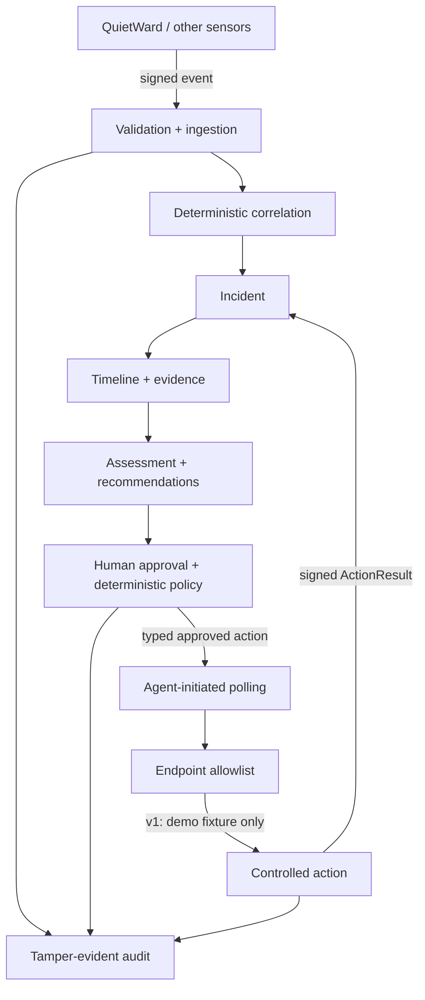

# QuietWard Response

**Incident investigation and controlled response without a generic remote-command surface.**

QuietWard Response is an Apache-2.0 licensed, event-driven security platform that validates telemetry, correlates related observations into explainable incidents, reconstructs timelines, recommends investigation steps, coordinates explicitly approved typed response actions, and records a tamper-evident audit trail.

> **Release:** `v1.0.0`  
> **Qualified source:** `release/v1.0.0`  
> **Runtime/API version:** `1.0.0`  
> **Intended use:** public-beta evaluation, homelabs, defensive-security research, and architecture demonstration on local/trusted networks.

The v1.0.0 executable scope is deliberately narrow. It proves the complete secure response lifecycle while refusing arbitrary shell commands or general host control.

## Why this project exists

Many response systems eventually need to move from *detect* to *act*. QuietWard Response explores how to do that without making the control plane an unrestricted remote administration tool.

The v1 safety path is:

`authenticated event -> deterministic correlation -> incident -> investigation -> recommendation -> human approval -> deterministic policy -> endpoint allowlist -> controlled action -> signed result -> tamper-evident audit`

An action must be explicitly registered before the API can create it, must be approved by an analyst, must pass deterministic server-side policy, and must be independently validated again by the endpoint before execution.

## Public beta / portfolio snapshot

- **Backend:** FastAPI, SQLAlchemy, Alembic
- **Frontend:** Next.js analyst console
- **Endpoint trust:** HMAC-SHA256 authenticated events, polling, and results
- **Replay protection:** persisted nonces and bounded timestamp validation
- **Response control:** typed action registry, explicit approval, deterministic policy, endpoint allowlist
- **Reliability:** idempotent action/result handling and crash/retry reconciliation
- **Audit:** hash-chained tamper-evident audit verification
- **Deployment:** cross-platform local bootstrap plus Docker Compose/PostgreSQL-ready path
- **License:** Apache-2.0

### Qualified v1.0.0 evidence

The release completed:

- **73 QuietWard Response backend tests**
- migration, upgrade, and ORM-drift verification
- frontend TypeScript and production build checks
- high-severity npm audit
- public quick-start startup and clean shutdown verification
- **182 companion QuietWard tests**
- real two-repository signed event -> incident -> approval -> action -> result HTTP acceptance
- browser route and incident-lifecycle smoke verification
- post-lifecycle audit-chain verification

The exact qualification contract is documented in [`docs/V1_ACCEPTANCE.md`](docs/V1_ACCEPTANCE.md).

## Architecture



QuietWard and QuietWard Response are separate projects. QuietWard handles detection/endpoint-side integration; Response handles correlation, investigation, recommendations, approval/policy, response coordination, and audit. Neither project requires the other to operate independently.

## Quick start

Requirements:

- Python 3.12+
- Node.js 22+
- npm
- Git

```text
git clone https://github.com/LUKEcheadle-ship-it/quietward-response.git
cd quietward-response
python scripts/bootstrap_local.py
```

Windows users can also run:

```text
py -3.12 scripts\bootstrap_local.py
```

The bootstrap path creates private local configuration, generates a random development enrollment token when needed, reconciles Python/frontend dependencies, applies migrations, starts both product surfaces, verifies readiness, and cleans up the process groups on shutdown.

Default local surfaces:

- Frontend: <http://localhost:3001>
- API: <http://localhost:8002>
- API docs: <http://localhost:8002/docs>
- Health: <http://localhost:8002/health>
- Audit verification: <http://localhost:8002/api/v1/audit/verify>

To populate safe synthetic investigation data after startup:

```text
python scripts/seed_demo.py --api-url http://localhost:8002
```

### Docker Compose

Docker Compose uses PostgreSQL and maps the API/frontend to loopback by default:

```bash
cp .env.example .env
# replace QWR_ENROLLMENT_TOKEN in .env with a random 24+ character value
docker compose up --build
```

## Controlled-response demonstration

The only executable v1.0.0 action is:

`restart_quietward_demo_service`

Despite the name, it **does not restart an operating-system service**. It modifies only a dedicated QuietWard-owned JSON demo fixture after:

1. an incident creates the eligible controlled recommendation;
2. an analyst prepares the action;
3. an analyst explicitly approves it;
4. deterministic Response policy validates the request;
5. the endpoint polls outward for work;
6. the endpoint independently validates the typed action;
7. the fixture changes exactly once;
8. a signed terminal result returns to Response; and
9. the lifecycle is recorded in the audit chain.

This demonstrates the response-control architecture without shipping unrestricted endpoint authority.

## Security boundary

QuietWard Response v1.0.0 is a local/trusted-network public-beta system, **not an Internet-facing production EDR/XDR/SOAR service**.

v1.0.0 deliberately has:

- no shell / PowerShell / cmd / bash execution
- no arbitrary process termination
- no arbitrary service control
- no file deletion or quarantine
- no firewall modification
- no host isolation
- no LLM-generated command execution
- no autonomous remediation
- no multi-tenant or horizontally scaled deployment claim
- no enterprise OIDC/RBAC claim

The API is qualified as a **single-process/single-worker** service. Analyst identity remains local-development grade, HMAC transport should use TLS outside loopback/trusted local development, and the audit chain provides tamper evidence rather than immutable storage.

See [`SECURITY.md`](SECURITY.md) and [`docs/threat-model.md`](docs/threat-model.md) for the complete security boundary.

## Verification

The full release gate is:

```text
python scripts/finalize_v1.py --quietward-repo ../quietward
```

Underlying deterministic/live gates:

```text
python scripts/verify_v1.py --quietward-repo ../quietward
python scripts/verify_v1_live.py --quietward-repo ../quietward
```

The repository also includes a public-release audit that scans tracked content and reachable Git history for sensitive/runtime files, high-confidence credential patterns, and selected private machine paths.

## Public beta feedback

Use GitHub Issues for reproducible bugs and feature requests. The included issue forms ask testers to sanitize logs and avoid posting credentials, private host data, customer information, or real incident evidence.

Security vulnerabilities should be reported privately through GitHub Security Advisories as described in [`SECURITY.md`](SECURITY.md).

## Project documentation

- [`docs/V1_ACCEPTANCE.md`](docs/V1_ACCEPTANCE.md) — exact v1 release qualification
- [`docs/architecture.md`](docs/architecture.md) — system architecture
- [`docs/threat-model.md`](docs/threat-model.md) — trust and security model
- [`protocol/README.md`](protocol/README.md) — event/action protocol
- [`CHANGELOG.md`](CHANGELOG.md) — v1.0.0 release details
- [`docs/PUBLIC_LAUNCH_KIT.md`](docs/PUBLIC_LAUNCH_KIT.md) — release, portfolio, and launch copy
- [`CONTRIBUTING.md`](CONTRIBUTING.md) — development and contribution requirements

## Portfolio summary

Built and qualified a FastAPI/Next.js controlled-response platform with authenticated telemetry, deterministic incident correlation, human-approved policy-gated endpoint actions, replay protection, idempotent execution, migrations, live cross-repository integration testing, and tamper-evident auditing.

Licensed under the **Apache License 2.0**.
