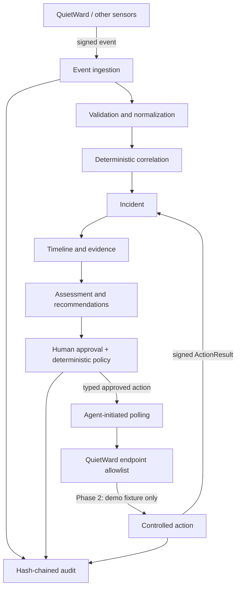

# QuietWard Response

QuietWard Response is an event-driven incident investigation and controlled-response platform. It validates sensor events, tracks hosts, deterministically correlates related observations into incidents, reconstructs timelines, recommends investigation steps, and records a tamper-evident audit trail.

Phase 2 adds an optional two-way QuietWard integration: authenticated endpoint telemetry, replay-resistant agent polling, explicit human approval, deterministic policy evaluation, and one deliberately isolated demo remediation. There is still **no arbitrary command execution** and no general host-remediation surface.

## Relationship with QuietWard

| Project | Responsibility |
|---|---|
| **QuietWard** | Detection, endpoint telemetry, endpoint-side validation, optional polling of approved typed actions |
| **QuietWard Response** | Correlation, investigation, recommendations, approval/policy, response coordination, and audit |

Neither project requires the other to exist. QuietWard remains fully functional when Response integration is disabled or unavailable.

## Architecture



See [architecture](docs/architecture.md), [event/action protocol](protocol/README.md), [threat model](docs/threat-model.md), and [roadmap](docs/roadmap.md).

## Quick start

Requirements: Python 3.12+, Node.js 22+, npm, Bash, and curl.

```bash
git clone https://github.com/LUKEcheadle-ship-it/quietward-response.git
cd quietward-response
git switch feature/phase2-secure-integration
cp .env.example .env
# Set a long random QWR_ENROLLMENT_TOKEN in .env before enrolling an agent.
./scripts/run_all.sh
```

The backend launcher applies Alembic migrations before starting. The existing synthetic Phase 1 demo remains usable alongside authenticated QuietWard telemetry.

- Frontend: <http://localhost:3001>
- API: <http://localhost:8002>
- API docs: <http://localhost:8002/docs>
- Health: <http://localhost:8002/health>
- Audit verification: <http://localhost:8002/api/v1/audit/verify>

Press `Ctrl+C` to stop both services.

### Run components separately

```bash
./scripts/run_backend.sh
./scripts/run_frontend.sh
python3 scripts/seed_demo.py --api-url http://localhost:8002
```

### Docker Compose

Docker Compose uses PostgreSQL and maps the API and frontend to loopback only:

```bash
cp .env.example .env
docker compose up --build
```

## Enroll a QuietWard endpoint

Start Response first and set `QWR_ENROLLMENT_TOKEN` to a strong local secret. Then enroll the endpoint once:

```bash
python3 scripts/enroll_quietward.py \
  --api-url http://127.0.0.1:8002 \
  --token "$QWR_ENROLLMENT_TOKEN" \
  --host-id YOUR_QUIETWARD_HOST_ID
```

The command prints these one-time endpoint values:

```text
QUIETWARD_RESPONSE_ENABLED=true
QUIETWARD_RESPONSE_URL=http://127.0.0.1:8002
QUIETWARD_RESPONSE_AGENT_ID=...
QUIETWARD_RESPONSE_KEY_ID=...
QUIETWARD_RESPONSE_SECRET=...
```

Store the secret securely on the endpoint. Response stores derived HMAC key material rather than the original enrollment secret, but that derived material is still secret-equivalent.

Authenticated agent requests bind the HTTP method, target path/query, Unix timestamp, random nonce, and SHA-256 body digest into an HMAC-SHA256 signature. The server enforces a bounded replay window and persists used agent nonces.

## Phase 2 controlled response demo

The only executable Phase 2 action is:

`restart_quietward_demo_service`

Despite the name, this does **not** restart an operating-system service. It modifies only a dedicated QuietWard-owned JSON demo fixture named `quietward-response-demo.json`. The endpoint rejects arbitrary action types, arbitrary service names, executable paths, shell fragments, and non-empty parameters.

On the QuietWard integration branch, initialize the demo fixture as unhealthy:

```bash
python scripts/quietward_response_demo.py init-unhealthy --host-id YOUR_QUIETWARD_HOST_ID
python scripts/quietward_response_demo.py sync --host-id YOUR_QUIETWARD_HOST_ID
```

The sync produces an authenticated `quietward_demo_service_unhealthy` event. Response creates an incident and exposes the allowlisted recommendation. In the incident console:

1. Prepare the controlled action.
2. Approve it.
3. Run another QuietWard sync or service cycle.
4. QuietWard polls for the approved action, validates it locally, changes only the dedicated demo fixture, and returns a signed result.
5. Response shows the action lifecycle and records it in the audit chain.

A durable endpoint action ledger prevents the same terminal action ID from being executed twice.

## API

Core Phase 1 endpoints:

- `POST /api/v1/events`
- `GET /api/v1/events`
- `GET /api/v1/hosts`
- `GET /api/v1/hosts/{host_id}`
- `GET /api/v1/incidents`
- `GET /api/v1/incidents/{incident_id}`
- `PATCH /api/v1/incidents/{incident_id}`
- `GET /api/v1/overview`

Phase 2 endpoints:

- `POST /api/v1/agents/enroll`
- `GET /api/v1/agents`
- `GET /api/v1/agents/{agent_id}`
- `GET /api/v1/actions/registry`
- `POST /api/v1/incidents/{incident_id}/actions`
- `GET /api/v1/incidents/{incident_id}/actions`
- `POST /api/v1/actions/{action_id}/approve`
- `POST /api/v1/actions/{action_id}/reject`
- `GET /api/v1/agents/{agent_id}/actions/pending` — agent-authenticated
- `POST /api/v1/actions/{action_id}/result` — agent-authenticated
- `GET /api/v1/audit/verify`

Events claiming `source=quietward` require authenticated agent delivery when `QWR_REQUIRE_AGENT_AUTH_FOR_QUIETWARD_EVENTS=true`. Synthetic/development sources remain available for the local demo and must not be treated as authenticated endpoint evidence.

## Verification

```bash
cd backend
../.venv/bin/python -m pytest -W error

cd ../frontend
npm run typecheck
npm run build
npm audit
```

The Phase 2 test suite covers enrollment, HMAC body binding, stale requests, replayed nonces, unsigned QuietWard rejection, action allowlisting, approval/policy gating, agent/host result binding, duplicate terminal results, and audit-chain tamper detection.

## Safety status

This is still a local-development system, not a production incident-response server.

Current response guarantees are intentionally narrow:

- no shell/PowerShell/cmd/bash action
- no arbitrary process termination
- no arbitrary service control
- no file deletion/quarantine
- no firewall modification
- no host isolation
- no LLM-generated command execution
- agent-initiated polling instead of an inbound endpoint command listener
- one demo-fixture action requiring human approval and deterministic policy validation

Analyst identity is still local-development grade (`X-Actor-ID`) rather than OIDC/RBAC. HMAC should be carried over TLS outside loopback/local trusted development. The audit chain provides tamper evidence, not immutability.

Licensed under Apache-2.0.
