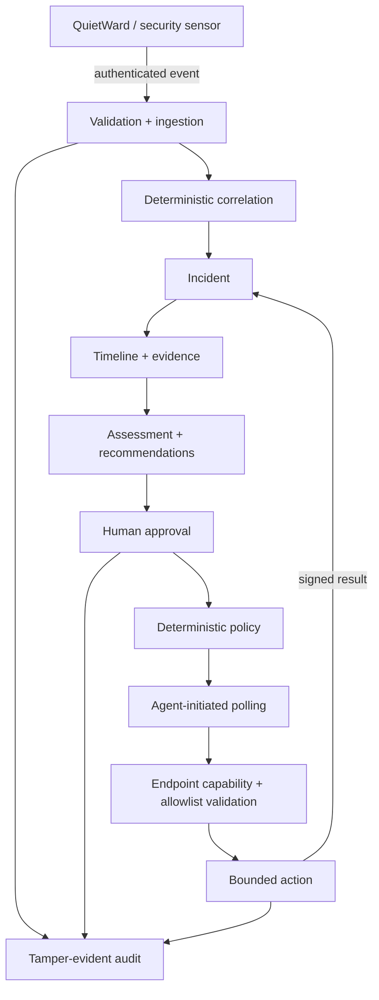

```mermaid
flowchart LR
    Q[QuietWard] -->|sanitized verified handoff| R[Response ingestion]
    R --> I[Incident + timeline]
    I --> A[Analyst approval]
    A --> P[Deterministic policy]
    P --> E[Response endpoint agent]
    E -->|read-only typed diagnostic| S[Signed result]
    S --> U[Tamper-evident audit]
```

# QuietWard Response

**Investigate, approve, and verify endpoint response — without exposing a remote shell.**

[](LICENSE)


QuietWard Response is an event-driven incident investigation and controlled-response platform for local and trusted-network security environments.

It turns authenticated security observations into explainable incidents, timelines, recommendations, explicit analyst decisions, tightly typed endpoint diagnostics, signed results, and tamper-evident audit history.

> **The design goal:** move from **detect** to **act** without turning the control plane into unrestricted remote administration.

## Engineering highlights

- **Full-stack security product:** FastAPI backend, Next.js frontend, PostgreSQL-supported local stack, and a browser-based analyst console.
- **Human-in-the-loop response:** recommendations, explicit analyst approval, deterministic policy enforcement, and endpoint-side validation are separate stages.
- **Authenticated event pipeline:** HMAC-SHA256 authentication, timestamp windows, persisted nonces, and replay resistance.
- **Constrained endpoint control:** typed, capability-declared actions replace arbitrary shell or remote-command execution.
- **Auditability:** signed endpoint results and a hash-chained audit ledger preserve evidence for later verification.
- **Failure-safe execution:** idempotent action handling and reconciliation are designed to avoid duplicate execution during retries or recovery.
- **Cross-project integration:** a sanitized, verified bridge accepts QuietWard findings while keeping detection and response authority separate.
- **Release discipline:** the paired candidate passed backend tests on Linux and Windows, frontend type/build checks, migration verification, dependency audit, and cross-repository acceptance before promotion to `main`.

## Try the full product with one command

Start the normal local stack with safe synthetic incidents already loaded:

```bash
python scripts/quick_demo.py
```

Windows:

```powershell
py -3.12 scripts\quick_demo.py
```

Then open the analyst console at `http://localhost:3001`.

The helper uses the existing synthetic seed path. It does **not** enable destructive endpoint authority, arbitrary commands, or autonomous remediation. See [`docs/TRY_IT.md`](docs/TRY_IT.md) for the guided walkthrough.

## What you can see immediately

A first-time user can explore:

- authenticated event ingestion
- deterministic incident correlation
- incident timelines and supporting evidence
- recommendation reasoning
- explicit analyst approval
- deterministic policy enforcement
- capability-aware endpoint targeting
- signed diagnostic results
- QuietWard provenance
- tamper-evident audit verification

## Why it is different

| Capability | Approach |
| --- | --- |
| **No generic command surface** | No arbitrary shell, PowerShell, cmd, bash, PID/path targeting, or LLM-generated command execution. |
| **Human-controlled actions** | Endpoint actions require explicit analyst approval and deterministic server-side policy. |
| **Endpoint-side validation** | The endpoint independently verifies the typed action and its declared capabilities before execution. |
| **Authenticated telemetry** | HMAC-SHA256 authentication, timestamp windows, persisted nonces, and replay resistance. |
| **Explainable incidents** | Deterministic correlation, evidence, timelines, and recommendation reasoning are retained. |
| **Idempotent execution** | Retry/recovery paths reconcile terminal state without silently executing the same action twice. |
| **Tamper-evident audit** | Security-relevant state changes are written to a hash-chained audit ledger with verification support. |

## QuietWard + Response

The current `1.1.0a1` preview pairs with **[QuietWard](https://github.com/LUKEcheadle-ship-it/quietward)** while keeping detection authority and response authority separated.



QuietWard remains observation-only and holds no Response network credential. Response owns authenticated ingestion, approval, policy, action lifecycle, endpoint capability validation, and auditing.

## Current controlled action surface

### Read-only diagnostics

- `collect_host_diagnostic`
- `collect_process_diagnostic`
- `collect_network_diagnostic` on supported Linux endpoints

These are parameterless, capability-declared, approval-gated investigation actions rather than arbitrary host access.

### Existing demonstration mutation

`restart_quietward_demo_service`

Despite the name, it does **not** restart an operating-system service. It changes only a dedicated JSON demo fixture used to prove the controlled mutation lifecycle.

There is still no general service control, process termination, quarantine, firewall modification, host isolation, or arbitrary command execution.

## Qualification evidence

The exact QuietWard `0.6.0a1` + Response `1.1.0a1` candidate pair was promoted to `main` only after the complete paired gate passed on both Linux and Windows runners.

Final gate evidence included:

- **97 Response backend tests on Linux**
- **96 Response backend tests + 1 platform-appropriate skip on Windows**
- fresh migrations, upgrade migrations, and Alembic drift verification
- frontend TypeScript checks and production Next.js build
- **npm audit: 0 vulnerabilities**
- public quick-start startup/shutdown smoke
- **441 QuietWard tests** with platform-appropriate skips
- **12 focused QuietWard handoff/privacy/integrity tests**
- public-release audits for both repositories
- live cross-repository QuietWard → Response acceptance
- signed action/result lifecycle verification
- audit-chain verification
- confirmation that the diagnostic changed **no system state**
- confirmation that raw QuietWard finding subjects **did not cross the boundary**

## Architecture



The endpoint agent polls outward for authorized work rather than exposing an inbound general-purpose command listener.

## Normal local start

Requirements:

- Python 3.12+
- Node.js 22+
- npm
- Git

```bash
git clone https://github.com/LUKEcheadle-ship-it/quietward-response.git
cd quietward-response
python scripts/bootstrap_local.py
```

Default local surfaces:

- Analyst console: `http://localhost:3001`
- API: `http://localhost:8002`
- API docs: `http://localhost:8002/docs`
- Health: `http://localhost:8002/health`
- Audit verification: `http://localhost:8002/api/v1/audit/verify`

### Docker Compose

```bash
cp .env.example .env
# replace QWR_ENROLLMENT_TOKEN with a random 24+ character value
docker compose up --build
```

Docker Compose uses PostgreSQL and maps the API/frontend to loopback by default.

## Verify the joint system

```bash
python scripts/verify_v11_diagnostics.py --quietward-repo ../quietward
```

That gate covers Response tests, public-release audit, migrations, frontend install/typecheck/build/audit, quick-start smoke, the complete QuietWard suite, the focused v0.6 handoff gate, and live cross-repository acceptance.

## Security boundary

QuietWard Response is a local/trusted-network security project and architecture demonstration. It is **not** presented as an Internet-facing production EDR/XDR/SOAR replacement.

The current preview deliberately has:

- no generic shell / PowerShell / cmd / bash execution
- no arbitrary process termination
- no arbitrary service control
- no file quarantine or deletion
- no firewall modification
- no host/network isolation
- no LLM-generated command execution
- no autonomous remediation
- no enterprise OIDC/RBAC claim
- no multi-tenant/horizontal-scaling claim

Analyst identity remains local-development grade. HMAC transport should use TLS outside loopback/trusted local development. The audit chain provides tamper evidence, not immutable storage.

## Explore or contribute

- [`docs/TRY_IT.md`](docs/TRY_IT.md) — guided product walkthrough
- [`docs/COMMUNITY_ROADMAP.md`](docs/COMMUNITY_ROADMAP.md) — public product direction
- [`docs/JOINT_QUIETWARD_RESPONSE_UPDATE.md`](docs/JOINT_QUIETWARD_RESPONSE_UPDATE.md) — paired-system design
- [`docs/V11_DIAGNOSTIC_UPGRADE.md`](docs/V11_DIAGNOSTIC_UPGRADE.md) — current diagnostics
- [`docs/architecture.md`](docs/architecture.md) — architecture
- [`docs/threat-model.md`](docs/threat-model.md) — trust model
- [`CONTRIBUTING.md`](CONTRIBUTING.md) — contribution guide

Good-first-issue and help-wanted tasks are deliberately scoped around UI, docs, tests, examples, portability, and bridge health so contributors can help without casually expanding endpoint authority.

## License

Apache License 2.0. See [`LICENSE`](LICENSE).
