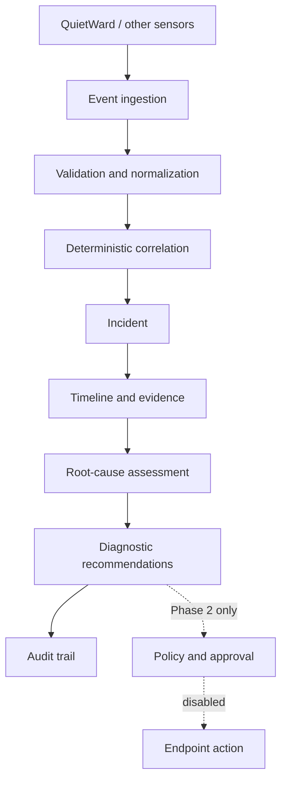

# QuietWard Response

QuietWard Response is an event-driven incident investigation and response coordination platform. It validates sensor events, tracks hosts, deterministically correlates related observations into incidents, reconstructs timelines, recommends investigation steps, and records an audit trail.

Phase 1 is deliberately non-destructive: it performs no endpoint actions and exposes no arbitrary command interface.

## Relationship with QuietWard

| Project | Responsibility |
|---|---|
| **QuietWard** | Detection and endpoint telemetry |
| **QuietWard Response** | Correlation, investigation, response coordination, and audit |

Neither project requires the other to exist. QuietWard Response accepts a versioned, sensor-neutral event envelope that QuietWard can implement later without a repository or runtime dependency.

## Architecture



See [architecture](docs/architecture.md), [event protocol](protocol/README.md), [threat model](docs/threat-model.md), and [roadmap](docs/roadmap.md).

## Quick start

Requirements: Python 3.12+, Node.js 22+, npm, Bash, and curl.

```bash
git clone https://github.com/LUKEcheadle-ship-it/quietward-response.git
cd quietward-response
git switch feature/phase1-foundation
./scripts/run_all.sh
```

The script creates a local Python virtual environment, installs dependencies, starts both applications, waits for API health, and submits three safe synthetic demo scenarios.

- Frontend: <http://localhost:3001>
- API: <http://localhost:8002>
- API docs: <http://localhost:8002/docs>
- Health: <http://localhost:8002/health>

Press `Ctrl+C` to stop both services.

### Run components separately

```bash
./scripts/run_backend.sh
./scripts/run_frontend.sh
python3 scripts/seed_demo.py --api-url http://localhost:8002
```

### Docker Compose

Docker Compose uses PostgreSQL and maps the API and frontend to loopback only:

```bash
cp .env.example .env
docker compose up --build
```

## API

Core endpoints:

- `POST /api/v1/events`
- `GET /api/v1/events`
- `GET /api/v1/hosts`
- `GET /api/v1/hosts/{host_id}`
- `GET /api/v1/incidents`
- `GET /api/v1/incidents/{incident_id}`
- `PATCH /api/v1/incidents/{incident_id}`
- `GET /api/v1/overview`

Event filters include `host`, `severity`, `event_type`, `start`, `end`, and `incident_id`. Duplicate event UUIDs return `409 Conflict`.

## Demo scenarios

The seeder submits only synthetic evidence:

1. Unknown executable → scheduled task → process launch → outbound connection
2. New listener → wildcard bind → unexpected service process
3. Disk growth → service degradation → service unavailable

All three exercise ingestion, host tracking, correlation, timeline construction, assessment, recommendations, and auditing. They contain no malware or destructive behavior.

## Verification

```bash
cd backend
../.venv/bin/python -m pytest -W error

cd ../frontend
npm run typecheck
npm run build
npm audit
```

## Safety status

This is an early local-development foundation, not a production response server. Remediation UI entries are visibly disabled as `Phase 2 — not enabled`. Authentication, authenticated agents, approval policy, cryptographic audit hardening, and endpoint actions belong to a later controlled phase.

Licensed under Apache-2.0.
