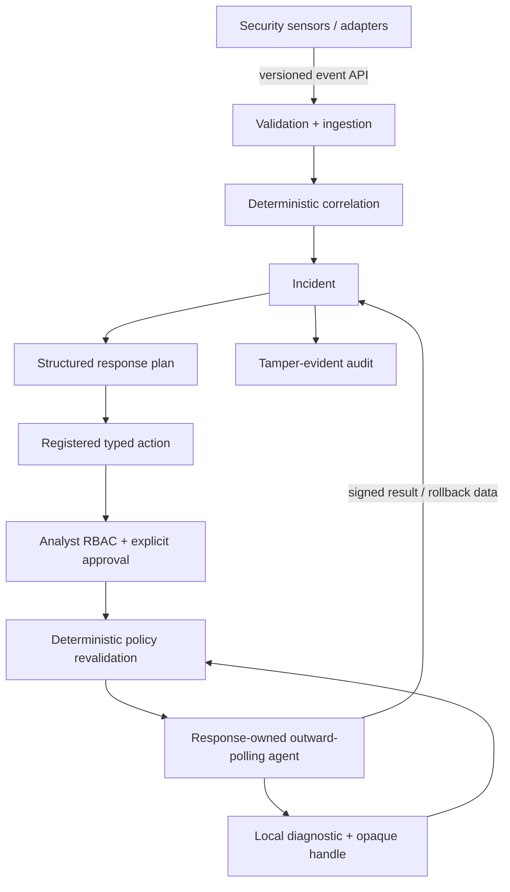

# QuietWard Response

QuietWard Response is a standalone incident-investigation and controlled-response platform. It accepts validated security telemetry, correlates observations into incidents, reconstructs timelines, generates structured response plans, manages analyst decisions, dispatches narrowly typed actions to a Response-owned agent, and records a tamper-evident audit trail.

It is a **separate product and repository from QuietWard**. Response does not require Response code inside QuietWard and does not modify the QuietWard repository. Sensors integrate through the versioned event API or separately maintained adapters.

> **Current hardening candidate:** `v1.2.0-alpha.1` (`1.2.0a1`) on `feature/response-v12-hardening`.
>
> v1.2 adds bounded read-only host/process/file diagnostics, short-lived incident-bound opaque resource handles, opt-in exact-process termination, managed-file quarantine/restore, action-specific TTL ceilings, API abuse bounds, and remote analyst bearer RBAC. There is still **no generic remote command surface**.

## Response coverage

For each incident, Response exposes:

`GET /api/v1/incidents/{incident_id}/response-plan`

Plans can cover:

- malware, ransomware, and suspicious files;
- process execution and privilege escalation;
- identity/authentication compromise and credential attacks;
- persistence;
- C2, beaconing, suspicious listeners and outbound activity;
- container/Kubernetes compromise;
- vulnerabilities and security-relevant configuration weaknesses;
- sensor/evidence integrity and defense evasion;
- operational failures that may overlap security incidents.

A plan contains priority, attack families, investigation steps, containment steps, recovery steps, escalation conditions, limitations, and the exact executable action list. Planned/manual/blocked steps remain visibly distinct from executable capabilities.

## v1.2 executable action surface

The registry is explicit and finite:

| Action | Type | Targeting |
|---|---|---|
| `restart_quietward_demo_service` | demo state change | no parameters |
| `collect_host_diagnostic` | read-only | no parameters |
| `collect_process_diagnostic` | read-only | no parameters; issues process handles |
| `terminate_process_by_handle` | high-impact containment | short-lived opaque process handle only |
| `collect_file_diagnostic` | read-only | configured managed roots only; issues file handles |
| `quarantine_artifact_by_handle` | reversible containment | short-lived opaque managed-file handle only |
| `restore_quarantined_artifact_by_handle` | rollback | quarantine rollback handle only |

Every registered action still requires analyst approval and deterministic server policy.

### What an opaque handle means

A Response agent creates a random `qwrh1_...` handle from its own local observation of a resource. The server never gets permission to invent a PID or filesystem path.

Before mutation the agent rechecks:

- action schema/type;
- target agent and host;
- incident provenance of the handle;
- handle kind and expiry;
- exact local resource fingerprint;
- local high-impact capability opt-in;
- server policy allowance and approval lifecycle;
- stale/replaced process/file conditions.

Handles cannot be reused across incidents. Process handles expire after five minutes; process-termination and quarantine action requests are capped at 240 seconds so approval cannot outlive the identity that justified it.

## File containment boundary

File diagnostics and quarantine operate **only** inside explicitly configured Response-agent managed roots.

The agent:

- enumerates bounded regular files only;
- does not issue handles for symbolic links;
- never accepts a server-supplied path;
- revalidates root membership, device/inode/size/mtime identity before quarantine;
- moves the file into a private configured quarantine directory;
- returns a separate rollback handle;
- refuses restore if the original path is occupied, outside the managed root, or the quarantine object changed;
- records consumption receipts so exact replay does not apply the mutation twice.

The quarantine directory must be outside all managed roots.

## Process containment boundary

Process diagnostics are implemented on Linux and Windows without a shell command supplied by the server.

The agent:

- returns a bounded process snapshot;
- protects its own process/parent and critical OS processes;
- binds handles to process identity data, not only PID;
- revalidates identity immediately before termination;
- refuses a stale/reused PID target;
- never accepts a raw PID from Response;
- fails closed if recovery after an interrupted termination is indeterminate.

High-impact process termination is disabled by default in the agent configuration and must be explicitly enabled.

## Architecture



Plan text never becomes executable code. An action must exist in the registry, be enabled by the specific incident's persisted recommendation set, pass server parameter/host/OS/lifecycle checks, receive approval, pass deterministic policy again at dispatch, and then pass the agent's independent local checks.

## Analyst authentication and RBAC

Loopback `development` keeps the historical `X-Actor-ID` convenience path for local testing.

Outside loopback development, Response **will not start without `QWR_ANALYST_CREDENTIALS`**. Human `/api/v1` requests require bearer authentication.

Roles:

- `viewer`: read-only API access;
- `responder`: viewer access plus incident updates, action creation, approval and rejection;
- `admin`: responder access plus agent enable/disable and future unclassified mutation endpoints.

Credentials are configured as:

`actor_id|role|sha256_token_hash`

Response config contains only the SHA-256 hash of a high-entropy bearer token. Generate a token/entry with:

```text
python scripts/generate_analyst_token.py --actor-id alice --role admin
```

Store the displayed bearer token in a secret manager. Example environment value with one or more hashed entries:

```text
QWR_ANALYST_CREDENTIALS='["alice|admin|<64-hex-sha256>"]'
```

The browser console stores a supplied analyst bearer token only in `sessionStorage`; it is removed when the browser session is cleared. An authenticated identity overrides `X-Actor-ID`, preventing audit-name spoofing.

Machine routes remain on separate protocols: enrollment token for enrollment, HMAC for Response-agent polling/results, and source-specific event authentication where configured.

## API abuse bounds

The current single-process/single-worker qualified runtime now also enforces:

- configurable API request-size limit (`QWR_API_MAX_REQUEST_BYTES`, default 1 MiB);
- configurable per-client `/api/v1` rate limit (`QWR_API_RATE_LIMIT_PER_MINUTE`, default 600/minute);
- `413` rejection before schema persistence for oversized bodies;
- `429` + `Retry-After` for rate-limit exhaustion;
- `no-store`, `nosniff`, frame, referrer and permissions hardening headers.

The limiter is process-local by design because multi-worker API execution is still outside the qualified boundary.

## Quick start

Requirements:

- Python 3.12+
- Node.js 22+
- npm
- Git

```text
git clone https://github.com/LUKEcheadle-ship-it/quietward-response.git
cd quietward-response
python scripts/bootstrap_local.py
```

On Windows, `py -3.12 scripts\bootstrap_local.py` is also supported.

Local defaults:

- Frontend: `http://localhost:3001`
- API: `http://localhost:8002`
- API docs: `http://localhost:8002/docs`
- Health: `http://localhost:8002/health`
- Audit verification: `http://localhost:8002/api/v1/audit/verify`

## Enroll a Response agent

Basic read-only/default agent:

```text
python scripts/enroll_response_agent.py \
  --host-id response-host \
  --token YOUR_ENROLLMENT_TOKEN
```

Enable process termination explicitly:

```text
python scripts/enroll_response_agent.py \
  --host-id response-host \
  --token YOUR_ENROLLMENT_TOKEN \
  --enable-process-termination
```

Enable managed-file quarantine/restore explicitly and define one or more safe roots:

```text
python scripts/enroll_response_agent.py \
  --host-id response-host \
  --token YOUR_ENROLLMENT_TOKEN \
  --managed-root /absolute/path/to/managed/data \
  --enable-file-quarantine
```

Use `--quarantine-dir` to select the private quarantine location. It must not be inside a managed root.

The helper writes the one-time agent secret to a permission-hardened local JSON config and does not print it. OS secret storage remains a post-alpha hardening target.

Inspect local agent capabilities:

```text
python scripts/response_agent.py capabilities --config PATH_TO_AGENT_JSON
```

Process pending approved actions once:

```text
python scripts/response_agent.py poll-once --config PATH_TO_AGENT_JSON
```

The agent initiates all network connections outward; it exposes no inbound command listener.

## Typical containment workflow

### Suspicious process

1. Incident identifies process/privilege activity.
2. Prepare and approve `collect_process_diagnostic`.
3. Agent returns bounded process rows and opaque handles for eligible processes.
4. Copy the desired `qwrh1_...` handle from the diagnostic result into `terminate_process_by_handle`.
5. Approve before its short action TTL expires.
6. Agent revalidates the exact local process identity and requests termination.
7. Signed result and audit record return to Response.

### Suspicious file

1. Configure the relevant directory as an agent managed root.
2. Prepare and approve `collect_file_diagnostic`.
3. Select the opaque handle for the exact artifact.
4. Prepare and approve `quarantine_artifact_by_handle`.
5. Agent revalidates and quarantines the object.
6. Preserve the returned rollback handle.
7. Use `restore_quarantined_artifact_by_handle` only if restoration is appropriate.

No workflow accepts a raw PID or path from the control plane.

## Core API

Investigation:

- `POST /api/v1/events`
- `GET /api/v1/events`
- `GET /api/v1/hosts`
- `GET /api/v1/hosts/{host_id}`
- `GET /api/v1/incidents`
- `GET /api/v1/incidents/{incident_id}`
- `GET /api/v1/incidents/{incident_id}/response-plan`
- `PATCH /api/v1/incidents/{incident_id}`
- `GET /api/v1/overview`

Controlled response:

- `POST /api/v1/agents/enroll`
- `GET /api/v1/agents`
- `GET /api/v1/agents/{agent_id}`
- `PATCH /api/v1/agents/{agent_id}`
- `GET /api/v1/actions/registry`
- `POST /api/v1/incidents/{incident_id}/actions`
- `GET /api/v1/incidents/{incident_id}/actions`
- `POST /api/v1/actions/{action_id}/approve`
- `POST /api/v1/actions/{action_id}/reject`
- `GET /api/v1/agents/{agent_id}/actions/pending`
- `POST /api/v1/actions/{action_id}/result`
- `GET /api/v1/audit/verify`

Authenticated agent requests bind method, path/query, timestamp, nonce and body digest with HMAC-SHA256. Replay nonces are persisted and consumed before later business validation.

## v1.2 qualification

Static/local gate:

```text
python scripts/verify_v12_alpha.py
```

Standalone live containment gate:

```text
python scripts/verify_v12_alpha_live.py
```

Exact clean feature-branch wrapper:

```text
python scripts/finalize_v12_alpha.py
```

The automated gate covers the full backend suite, migrations, public-release audit, typed action surface, disposable process/file containment, RBAC, API abuse bounds, frontend typecheck/build/high-severity npm audit, quick-start cleanup, live HMAC agent polling/results, exactly-once behavior and audit verification.

Then perform the browser smoke in `docs/V12_ALPHA_ACCEPTANCE.md` on the exact candidate SHA.

Historical qualification docs remain under `docs/`.

## What is still intentionally not executable

v1.2 still does **not** expose:

- arbitrary shell / PowerShell / cmd / bash;
- generic command or script execution;
- raw PID/path targeting;
- general service control;
- firewall/network-rule modification;
- host isolation;
- arbitrary account/session mutation;
- persistence-object mutation;
- container stop/remove;
- package/configuration mutation;
- autonomous remediation;
- LLM-generated executable commands.

Future actions must follow the same pattern: narrow schema, local opaque identity, stale-target protection, explicit opt-in when high impact, approval, deterministic policy, expiry, durable execution state, rollback/failure semantics, least privilege and adversarial qualification.

## Known alpha limitations

- analyst bearer authentication is a strong local/trusted-deployment improvement but is not a full enterprise OIDC/SSO integration yet;
- the browser token is session-scoped JavaScript storage, so deployment still requires normal XSS/CSP hygiene and TLS;
- HMAC transport requires TLS outside loopback/trusted local development;
- Response-agent credentials use a permission-hardened JSON file unless the operator supplies stronger secret storage externally;
- the audit chain is tamper-evident, not immutable external retention;
- API qualification remains single process/single worker;
- Linux process termination currently requests `SIGTERM`; Windows uses the native process-termination API;
- file quarantine is limited to configured managed roots and is not an antivirus vault;
- network, identity, persistence, container and package/configuration mutation remain future narrow executors;
- this is not an autonomous remediation system.

Licensed under Apache-2.0.
