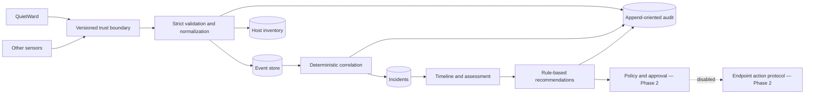

# Architecture

QuietWard Response is a sensor-neutral investigation control plane. QuietWard is an intended producer of protocol v1 events, but the projects remain independently deployable and versioned.

## Layers

- `protocol/` is the external compatibility contract. It contains observations, not commands.
- `backend/app/api/` owns HTTP validation and response shape.
- `backend/app/services/` owns normalization, correlation, timelines, recommendations, and auditing.
- `backend/app/integrations/` adapts versioned sensor protocols to the neutral event model.
- `backend/app/database/` owns SQLAlchemy persistence. SQLite supports local work; the same model and Alembic entrypoint support PostgreSQL.
- `frontend/` is a read-oriented investigation UI. Its only mutation is an explicitly attributed incident status/severity review.

## Deterministic correlation v1

Correlation first scopes candidates to the same host and a configurable five-minute window. It then requires at least one explainable relationship: category, process identifier, executable/file path or hash, network destination, or persistence mechanism. The selected reasons are persisted on the incident and shown to analysts.

An initial reportable event opens an incident rather than disappearing into an opaque queue. Later related evidence updates severity, confidence, timeline bounds, cause assessment, and recommendations. An LLM is not used for correlation or action selection.

## Data and audit

Events preserve the accepted payload and a normalized representation. Hosts are upserted from reports. Incidents reference events through an indexed foreign key. Important operations create a separate audit row with actor, action, resource, timestamp, and structured details.

The Phase 1 audit is append-oriented at the application layer, not a cryptographic ledger. Hash chaining, signed checkpoints, external retention, and tamper-evident export are Phase 2 hardening items.
