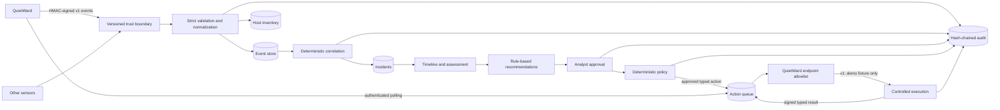

# Architecture

QuietWard Response is a sensor-neutral incident investigation and controlled-response plane. QuietWard is the first authenticated endpoint integration, but the projects remain independently deployable and versioned.



## Layers

- `protocol/` defines the external compatibility contracts for observations and typed response actions. It contains no generic command interface.
- `backend/app/api/` owns HTTP validation, enrollment, agent-authenticated endpoints, incidents, actions, and audit verification.
- `backend/app/services/` owns normalization, correlation, timelines, recommendations, HMAC request verification, policy, action lifecycle, and tamper-evident auditing.
- `backend/app/integrations/` adapts versioned sensor protocols to the neutral event model.
- `backend/app/database/` owns SQLAlchemy persistence. SQLite supports local development; Alembic and the same models support PostgreSQL.
- `frontend/` is the analyst console for incidents, events, hosts, enrolled agents, approvals, policy status, and structured action results.
- QuietWard remains the endpoint trust boundary. It initiates polling, validates the target/type/parameters again, and has no inbound remote-command listener.

## Deterministic correlation v1

Correlation first scopes candidates to the same host and a configurable time window. It then requires explainable relationships such as category, process identifier, executable/file path or hash, network destination, or persistence mechanism. The selected reasons are persisted on the incident and shown to analysts.

An initial reportable event opens an incident rather than disappearing into an opaque queue. Later related evidence updates severity, confidence, timeline bounds, cause assessment, and recommendations. An LLM is not used for correlation, approval, policy evaluation, or action selection.

## Agent authentication and replay protection

Enrolled QuietWard agents receive a one-time secret. Response stores derived HMAC key material rather than the original enrollment secret. Signed requests bind:

```text
HTTP method
path + query
Unix timestamp
random nonce
SHA-256 of exact body bytes
```

The server validates agent/key identity, enabled state, host binding, bounded timestamp skew, signature, and persisted nonce uniqueness. Events claiming `source=quietward` require this authenticated path by default.

## Controlled action lifecycle

The v1 lifecycle is:

```text
pending
  -> approved
  -> dispatching
  -> executing
  -> succeeded | failed
```

Alternate terminal states are `rejected`, `expired`, and `cancelled`.

The server action registry contains exactly one executable v1 action: `restart_quietward_demo_service`. It accepts no parameters and modifies no operating-system service. QuietWard applies it only to the dedicated `quietward-response-demo.json` fixture.

An `executing` action may be re-delivered to the same authenticated endpoint after an interruption. QuietWard persists execution intent before applying local state, stores terminal results in a durable ledger, and stores the applied action ID/result in the fixture. Repeated delivery therefore reconciles the action rather than applying it twice.

## Data and audit

Events preserve both the accepted payload and normalized representation. Hosts are upserted from reports. Incidents reference events through indexed foreign keys. Agents, approvals, actions, nonces, and action results are stored separately.

Every important lifecycle operation appends an audit row containing actor, action, resource, timestamp, details, previous hash, and entry hash. The audit chain can detect modification or broken linkage with `/api/v1/audit/verify`. This provides tamper evidence, not immutable storage; external retention and signed checkpoints remain future hardening.

## v1 trust boundary

QuietWard Response v1 is intentionally not a remote administration framework. It has no generic shell/PowerShell/cmd/bash execution, arbitrary process termination, arbitrary service control, file deletion/quarantine, firewall modification, or host isolation. Future response capabilities must remain typed, allowlisted, approval-gated, policy-checked, endpoint-validated, and auditable.
