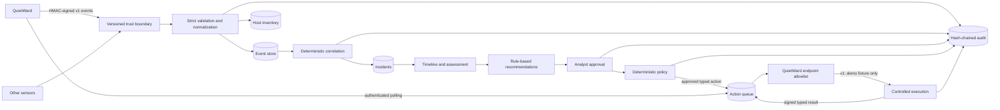

# Architecture

QuietWard Response is a sensor-neutral incident investigation and controlled-response plane. QuietWard is the first authenticated endpoint integration, but the projects remain independently deployable and versioned.



## Layers

- `protocol/` defines the external compatibility contracts for observations and typed response actions. It contains no generic command interface.
- `backend/app/api/` owns HTTP validation, enrollment, agent-authenticated endpoints, incidents, actions, and audit verification.
- `backend/app/services/` owns normalization, correlation, timelines, recommendations, HMAC request verification, policy, action lifecycle, and tamper-evident auditing.
- `backend/app/integrations/` adapts versioned sensor protocols to the neutral event model.
- `backend/app/database/` owns SQLAlchemy persistence. SQLite supports local development; Alembic and the same models support PostgreSQL.
- `frontend/` is the analyst console for incidents, events, hosts, enrolled agents, approvals, policy status, and structured action results.
- QuietWard remains the endpoint trust boundary. It initiates polling, validates the target/type/parameters again, and has no inbound remote-command listener.

## Runtime and schema ownership

Normal native, container, bootstrap, and acceptance launch paths apply Alembic first and start Uvicorn through `app.main:runtime_app --factory`. The runtime application does **not** call mutable ORM `create_all`, so missing migrations cannot be silently hidden by current model metadata. Direct schema creation remains available only for isolated test/embedded-development application instances.

After migration, startup backfills a wholly legacy/unhashed Phase 1 audit history once where appropriate, verifies the complete hash chain, and refuses to serve if existing tamper evidence is broken. Local SQLite files are permission-hardened where supported.

v1 intentionally runs a single API process/worker. HTTP request transactions are serialized inside that process because audit records form one linear chain. Multi-worker or horizontally scaled operation requires a future database-backed atomic audit-head/append mechanism and requalification.

## Deterministic correlation v1

Correlation first scopes candidates to the same host and a configurable time window. It then requires explainable relationships such as category, process identifier, executable/file path or hash, network destination, or persistence mechanism. Closed incidents are excluded from future correlation candidates, so fresh related evidence opens a new active incident rather than disappearing into resolved history.

An initial reportable event opens an incident rather than disappearing into an opaque queue. Later related evidence updates severity, confidence, timeline bounds, cause assessment, and recommendations. An LLM is not used for correlation, approval, policy evaluation, or action selection.

## Agent authentication and replay protection

Enrolled QuietWard agents receive a one-time secret. Response stores derived HMAC key material rather than the original enrollment secret. Signed requests bind:

```text
HTTP method
path + query
Unix timestamp
random nonce
SHA-256 of exact body bytes
```

The server validates agent/key identity, enabled state, host binding, bounded timestamp skew, signature, and persisted nonce uniqueness. Events claiming `source=quietward` require this authenticated path by default. Valid nonces are committed before later business validation so a signed request rejected after authentication cannot replay the same nonce.

The known development enrollment token and any configuration disabling QuietWard event authentication are accepted only on a loopback development bind. Non-loopback binds require a replacement token, authenticated QuietWard telemetry, and non-wildcard CORS.

## Controlled action lifecycle

The v1 lifecycle is:

```text
pending
  -> approved
  -> dispatching
  -> executing
  -> succeeded | failed
```

Alternate terminal states are `rejected`, `expired`, and `cancelled`.

Approval/rejection is single-shot at the analyst API boundary. A later request cannot overwrite the original approver or reverse the recorded decision; cancellation and revocation use explicit lifecycle transitions instead.

The server action registry contains exactly one executable v1 action: `restart_quietward_demo_service`. It accepts no parameters and modifies no operating-system service. QuietWard applies it only to the dedicated `quietward-response-demo.json` fixture.

Action creation requires the capability to be an enabled controlled recommendation on that exact active incident. Policy rechecks the registered type, parameter schema, incident state/recommendation binding, target host/agent, OS support, exact approval/action/request binding, approval expiry, and action expiry before dispatch. Only one active lifecycle is permitted per incident + host + action type, even during agent credential rotation.

A `dispatching` action has been returned to an endpoint but has not yet been acknowledged as executing. If the incident closes or the target agent is disabled at this point, Response cancels that pre-execution lifecycle. QuietWard posts an `executing` result before changing local state, so a cancelled dispatch cannot subsequently acknowledge execution.

Once the endpoint has acknowledged `executing`, the action is considered in-flight. QuietWard persists execution intent before applying local state, stores terminal results in a durable ledger, and stores the applied action ID/result in the fixture. Repeated delivery therefore reconciles the action rather than applying it twice.

Agent revocation blocks new telemetry and new action delivery. A disabled agent retains only a narrow reconciliation path: polling may return its own already-`executing` action, and result submission is accepted only for matching `executing`/terminal lifecycles. Cancelled/pre-execution work cannot be revived.

## Data and audit

Events preserve both the accepted payload and normalized representation. Hosts are upserted from reports. Incidents reference events through indexed foreign keys. Agents, approvals, actions, nonces, and action results are stored separately.

Every important lifecycle operation appends an audit row containing actor, action, resource, timestamp, details, previous hash, and entry hash. The audit chain can detect modification or broken linkage with `/api/v1/audit/verify`, and startup verifies it before serving. This provides tamper evidence, not immutable storage; external retention and signed checkpoints remain future hardening.

## v1 trust boundary

QuietWard Response v1 is intentionally not a remote administration framework. It has no generic shell/PowerShell/cmd/bash execution, arbitrary process termination, arbitrary service control, file deletion/quarantine, firewall modification, or host isolation. Future response capabilities must remain typed, allowlisted, approval-gated, policy-checked, endpoint-validated, idempotent, and auditable.
